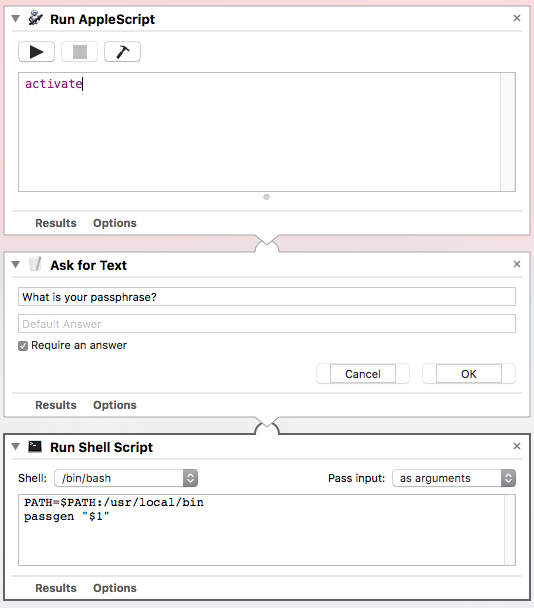

# Using PassGen with MacOS Automator
Once you've installed and setup PassGen on your Mac, adding an automator workflow that
prompts for your passphrase is easy.  This makes generating a password from any application quick and painless.

1. Open Automator and create a new Service
1. Add a Run AppleScript action and add paste in the following code
    
    ```AppleScript
    global frontmostProcess
    tell application "System Events"
    set frontmostProcess to first process where it is frontmost
    end tell

    set userCancelled to false
    set gave_up to false
    set my_passphrase to ""
    try
        set dialogReturn to (display dialog "Please enter your passphrase" ¬
            with title "PassGen" ¬
            default answer "" ¬
            buttons {"Cancel", "Generate Password"} ¬
            default button 2 ¬
            with hidden answer ¬
            giving up after 10)
        set my_passphrase to the text returned of dialogReturn
        set gave_up to gave up of dialogReturn
        on error number -128
        set userCancelled to true
    end try

    if (not userCancelled and not gave_up) then
        do shell script "PATH=$PATH:/usr/local/bin; passgen '" & my_passphrase & "'"
        display notification "Password copied to clipboard" ¬
            with title "PassGen"
    end if

    set frontmost of frontmostProcess to true
    ```
1. Save your Automator service
1. Go to System Preferences > Keyboard > Shortcuts. Select Services in the left pane and scroll down to the General section.  You should see your PassGen automator service, select it and add a keyboard shortcut. This can also be done in any other application that supports keyboard shortcuts like BetterTouchTool.

