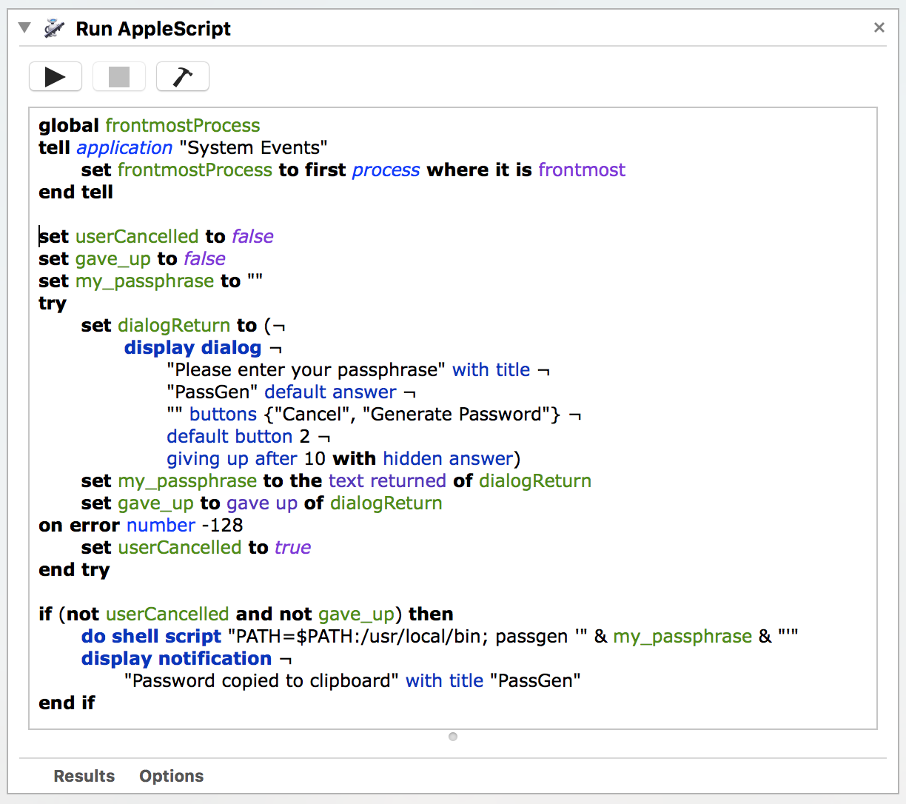

# Using PassGen with MacOS Automator
Once you've installed and setup PassGen on your Mac, adding an automator workflow that
prompts for your passphrase is easy.  This makes generating a password from any application quick and easy.

1. Open Automator and create a new Service
1. Add a Run AppleScript action and add the word ```activate``` to the script section
1. Add a Ask for Text action with 'What is your passphrase?' for the question (you can change the question to be whatever you want)
1. Add a Run Shell Script action with the following text

    ```bash
    PATH=$PATH:/usr/local/bin
    passgen "$1"
    ```

1. Save your Automator service
1. Go to System Preferences > Keyboard > Shortcuts. Select Services in the left pane and scroll down to the General section.  You should see your PassGen automator service, select it and add a keyboard shortcut. This can also be done in any other application that supports keyboard shortcuts like BetterTouchTool.

